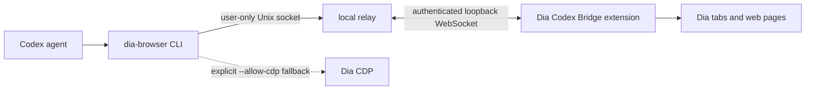

# dia-cdp

Extension-first browser bridge, standalone CDP CLI, and Codex plugin for the Dia
browser on macOS.

This project is a Dia-focused fork of a lightweight raw Chrome DevTools Protocol
CLI. It does not depend on Codex's bundled `chrome-cdp` skill directory.

## Codex Plugin Install

Install from the public marketplace repo:

```bash
codex plugin marketplace add psh4607/dia-cdp --ref main
codex plugin add dia-cdp@dia-cdp
```

Verify:

```bash
codex plugin list --json | jq '.installed[] | select(.pluginId == "dia-cdp@dia-cdp")'
```

The plugin ships the `dia-cdp` skill and a skill-local `scripts/dia-cdp`
wrapper, so Codex agents can use the bundled CLI from the installed plugin
cache without depending on the old `chrome-cdp` skill.

Installing the Codex plugin makes the skill available to agents. The Dia
extension bridge is a separate, one-time local installation because Dia must
explicitly load the unpacked extension. Follow the next section after installing
the plugin.

## Dia Extension Bridge

The extension bridge manages tabs, inspects pages, interacts with elements, and
captures visible screenshots without opening a CDP WebSocket or triggering
Dia's recurring `Allow debugging` dialog. It requests:

- `tabs`, to read tab titles and URLs
- `scripting` and `<all_urls>`, to inspect and interact with ordinary web pages
- `http://127.0.0.1/*`, to communicate with the user-only loopback relay
- `alarms`, to reconnect after Dia wakes an inactive extension worker

Dia presents the broad site-access permission once when the unpacked extension
is installed or upgraded. The bridge does not request the more powerful
`debugger` or `nativeMessaging` permissions and does not accept arbitrary
JavaScript evaluation from the CLI.

### How the bridge works



The CLI does not connect directly to the extension. It sends a fixed,
allowlisted command to a local relay over
`~/.cache/dia-cdp/extension-bridge.sock`. The relay runs as the current macOS
user, listens only on `127.0.0.1:47137`, and authenticates the extension with a
private token. The extension then performs the requested operation through
`chrome.tabs` or `chrome.scripting` and returns a bounded result.

Ordinary bridge commands do not enable remote debugging. Advanced operations
such as network response inspection still use the separate CDP fallback and
require an explicit `--allow-cdp` invocation.

### Prerequisites

- macOS with Dia installed in `/Applications/Dia.app`
- Node.js 22 or newer
- A local checkout of this repository for the one-time bridge installer

### Quick start

1. Install the Codex plugin as shown above.
2. Clone this repository and install the per-user extension and relay payloads:

   ```bash
   git clone https://github.com/psh4607/dia-cdp.git
   cd dia-cdp
   bin/install-dia-extension-host
   ```

3. Open `chrome://extensions` in Dia and enable **Developer mode**.
4. Choose **Load unpacked** and select:

   ```text
   ~/.local/share/dia-cdp/extension/
   ```

5. Confirm that the extension is named **Dia Codex Bridge** and has the stable
   id `jkijmmbnkcgjmpagmpflooolealenfkf`.
6. Verify the relay, extension connection, and a real tab request:

   ```bash
   bin/dia-browser health
   bin/dia-browser ping
   bin/dia-browser list
   ```

`health` should report `relay: "running"` and `extensionConnected: true`.
`ping` should return the bridge name and version. The extension badge also
changes to **ON** while its authenticated relay connection is active.

### Install the local payloads

Preview the extension and relay destinations without writing anything:

```bash
bin/install-dia-extension-host --dry-run
```

Install both payloads for the current macOS user:

```bash
bin/install-dia-extension-host
```

The unpacked extension is copied to a version-independent location:

```text
~/.local/share/dia-cdp/extension/
```

The relay runtime is likewise copied to:

```text
~/.local/share/dia-cdp/relay/
```

The installer generates a private relay token at:

```text
~/.local/share/dia-cdp/bridge-token
```

The token file and the generated extension configuration are readable only by
the current macOS user.

### Load the unpacked extension

1. Open Dia's extensions page and enable Developer mode.
2. Choose **Load unpacked** and select `~/.local/share/dia-cdp/extension/`.
3. Verify that Dia shows the stable extension id
   `jkijmmbnkcgjmpagmpflooolealenfkf`.

### Updating the bridge

After pulling a newer repository version, rerun the installer:

```bash
git pull --ff-only
bin/install-dia-extension-host
```

The installer refreshes the stable extension payload, relay runtime, and
LaunchAgent without changing the extension id or private bridge token. If Dia
does not reload the worker automatically, use **Reload** on the extension card
in `chrome://extensions`, then rerun the health checks.

### Troubleshooting

- `relay: "running"`, `extensionConnected: false`: confirm that the unpacked
  extension is enabled, then press **Reload** on its extension card.
- The Unix socket is missing or `health` cannot reach the relay: rerun
  `bin/install-dia-extension-host` and retry after a few seconds.
- `ping` reports an older version: reload the unpacked extension. The relay asks
  an outdated worker to reload, but Dia may defer that until the worker wakes.
- A command rejects a `chrome://` page: this is an intentional browser security
  boundary. Run the command against an ordinary `http://` or `https://` tab.
- A command says that CDP is required: rerun only that operation with
  `--allow-cdp`; normal bridge commands should not need it.

### Use the bridge

Use the unified extension-first router for normal work:

```bash
bin/dia-browser health
bin/dia-browser list
bin/dia-browser snapshot <tab-id>
bin/dia-browser click <tab-id> '#save'
bin/dia-browser shot <tab-id> /tmp/dia.png
```

The router never silently falls back to CDP. CDP-only commands stop with an
explanation unless the invocation explicitly includes `--allow-cdp`:

```bash
bin/dia-browser --allow-cdp net <cdp-target>
bin/dia-browser --allow-cdp eval <cdp-target> 'document.title'
bin/dia-browser cdp-status
bin/dia-browser cdp-stop <cdp-target>
```

An approved per-tab CDP daemon is reused for eight hours by default. Set
`DIA_CDP_IDLE_TIMEOUT_MS` to choose a different positive idle duration.

### Default Dia lifecycle

Use separate commands for automation-session cleanup and browser lifecycle:

```bash
bin/dia-browser dia-status
bin/dia-browser dia-start
bin/dia-browser safe-stop
bin/dia-browser safe-dia-stop
bin/dia-browser safe-dia-restart
bin/dia-browser safe-dia-restart --enable-cdp
```

`safe-stop` stops only reusable CDP daemons and leaves Dia open.
`safe-dia-stop` sends `SIGTERM` only to default Dia root processes and excludes
every process launched with `--user-data-dir`, so isolated automation profiles
are not touched. It never escalates to `SIGKILL`. `safe-dia-restart` starts the
same default profile again and waits for the extension bridge to reconnect.
Remote debugging stays off unless `--enable-cdp` is explicit.

The lower-level extension command remains available:

```bash
bin/dia-extension ping
bin/dia-extension list
bin/dia-extension get <tab-id>
bin/dia-extension activate <tab-id>
bin/dia-extension window-focus <tab-id>
bin/dia-extension snapshot <tab-id>
bin/dia-extension query <tab-id> '#save'
bin/dia-extension text <tab-id> main
bin/dia-extension html <tab-id> main
bin/dia-extension click <tab-id> '#save'
bin/dia-extension type <tab-id> '#name' 'Seongho Bak'
bin/dia-extension focus <tab-id> '#search'
bin/dia-extension scroll <tab-id> '#details'
bin/dia-extension scroll-by <tab-id> 0 600
bin/dia-extension select <tab-id> '#team' backend
bin/dia-extension key <tab-id> '#search' Enter
bin/dia-extension shot <tab-id> /tmp/dia.png
bin/dia-extension create https://example.com/
bin/dia-extension navigate <tab-id> https://example.com/
bin/dia-extension reload <tab-id>
bin/dia-extension close <tab-id>
```

## Isolated Automation Profile

When an automation task does not need the user's main Dia cookies or tabs, start
a separate Dia process with its own persistent user-data directory and an
ephemeral debugging port:

```bash
bin/dia-automation path
bin/dia-automation start https://example.com/
bin/dia-automation status
bin/dia-automation list
bin/dia-automation snap <target>
bin/dia-automation stop
```

The default profile lives at
`~/.local/share/dia-cdp/automation-profile`. Log in to required sites inside
that profile once. The launcher never copies or shares
`~/Library/Application Support/Dia/User Data`, and `stop` verifies the recorded
process command before signaling its process group. Profile data is preserved
after stopping. Override the location with `DIA_AUTOMATION_PROFILE_DIR` only
when another isolated directory is required.

The automation profile is intentionally independent from the extension bridge.
It is useful for CDP-heavy tasks where a separate login is acceptable. Use the
extension-first `dia-browser` path for the user's existing Dia session.

## Optional High-Privilege Capabilities

Version 0.5.0 adds window focus without adding a manifest permission. Cookie,
download, clipboard, request observation or modification, file URL, and
incognito capabilities remain unsupported by default. Add one only when there
is a concrete use case and its permission warning is acceptable.

Use `dia-cdp` only for capabilities the extension cannot expose, including
network response bodies, performance traces, and unrestricted CDP domains.

The CLI starts a relay bound only to `127.0.0.1:47137` and communicates with it
through a user-only Unix socket at `~/.cache/dia-cdp/extension-bridge.sock`.
The extension keeps an authenticated loopback WebSocket open and sends a
heartbeat every 20 seconds; a 30-second alarm provides cold reconnect recovery.
The installer also registers a user LaunchAgent that starts the relay at login
and restarts it after a crash. On the first command after a plugin update, the
CLI synchronizes the stable payload automatically; the old extension worker
then reloads itself when the permission set has not changed.
The relay requires both the private token and the extension's exact origin. A
public manifest key keeps that extension id unchanged when the plugin
installation path or version changes; no private signing key ships with the
repository. Stable extension and relay installation directories likewise keep
the bridge working when Codex refreshes its plugin cache.

## CLI Install

Use the project wrapper directly:

```bash
/Users/seongho/projects/seongho/projects/dia-cdp/bin/dia-cdp list
```

For the local user command, point `~/.local/bin/dia-cdp` at this wrapper:

```bash
ln -sfn /Users/seongho/projects/seongho/projects/dia-cdp/bin/dia-cdp ~/.local/bin/dia-cdp
```

`~/.local/bin` is already on this machine's `PATH`.

## Usage

List Dia tabs:

```bash
dia-cdp list
```

Capture an accessibility snapshot:

```bash
dia-cdp snap <target>
```

Evaluate JavaScript:

```bash
dia-cdp eval <target> 'document.title'
```

Capture a screenshot:

```bash
dia-cdp shot <target> /tmp/dia.png
```

Restart Dia with CDP on port `9222`:

```bash
dia-cdp --restart list
```

If Dia blocks graceful quit and you explicitly accept closing it:

```bash
dia-cdp --restart --force-kill list
```

## How It Works

`bin/dia-cdp` is the Dia launcher and safety wrapper. It uses:

- Dia app: `/Applications/Dia.app`
- Port file: `~/Library/Application Support/Dia/User Data/DevToolsActivePort`
- CDP port: `9222`
- Engine: `src/cdp.mjs`

`src/cdp.mjs` holds the raw CDP client and per-tab daemon. `extension/` contains
the Manifest V3 extension, while `src/extension-host.mjs` and
`src/extension-client.mjs` implement the loopback WebSocket and Unix-socket bridge.
Runtime sockets and page cache live under `~/.cache/dia-cdp` or
`$XDG_RUNTIME_DIR/dia-cdp`, so this project does not share daemon state with the
original `chrome-cdp` script.

## Plugin Layout

- `.agents/plugins/marketplace.json` exposes this repository as a Codex plugin marketplace.
- `.codex-plugin/plugin.json` describes the `dia-cdp` plugin.
- `extension/` contains the extension-first Dia bridge.
- `bin/dia-automation` manages the isolated automation-only Dia profile.
- `skills/dia-cdp/SKILL.md` tells Codex when to prefer Dia CDP over Chrome CDP.
- `skills/dia-cdp/scripts/dia-cdp` runs the CLI bundled in the installed plugin.
